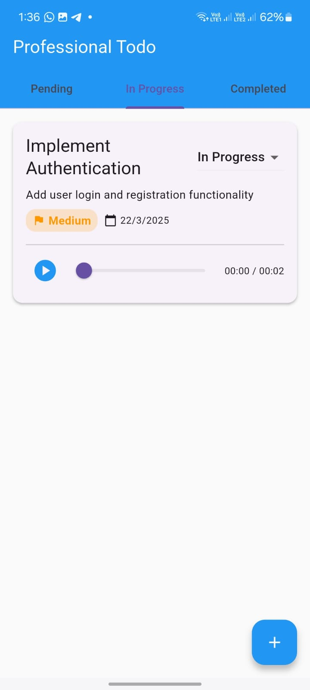
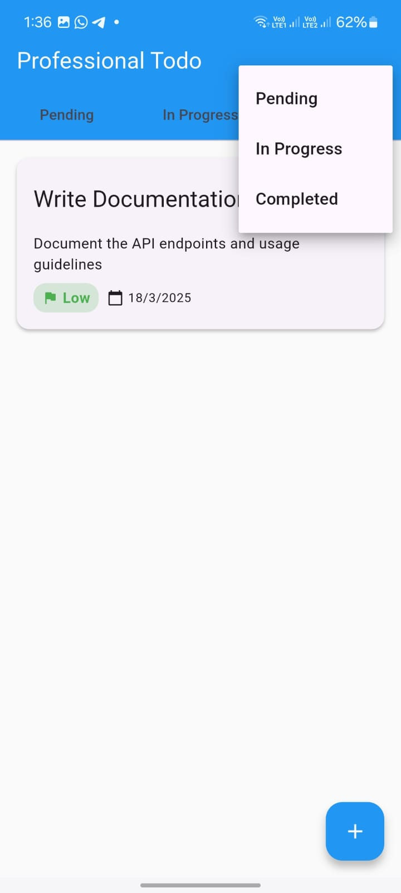
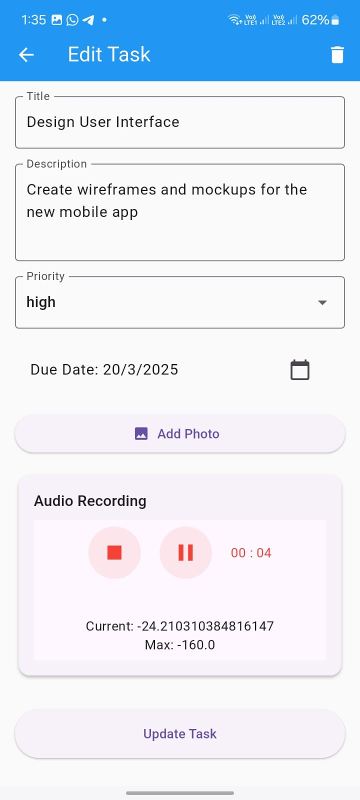
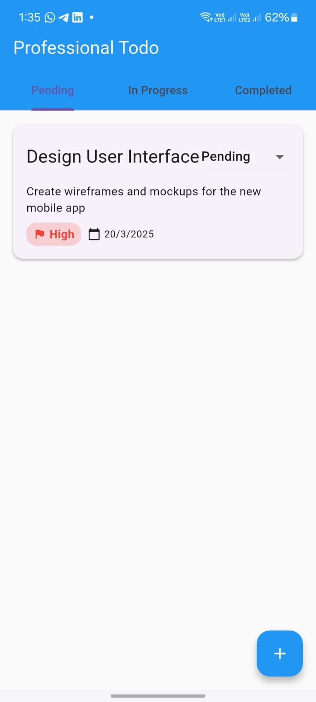

# Professional Todo App

A feature-rich Flutter Todo application with modern UI, task management, media attachments, and audio recording capabilities.

## Screenshots

<div style="display: flex; justify-content: space-between;">
    
    
    
    
</div>

## Features

- ✨ Clean and modern Material Design UI
- 📱 Responsive layout for both phone and tablet
- 🎯 Task priority levels (High, Medium, Low)
- 📊 Task status tracking (Pending, In Progress, Completed)
- 📸 Image attachment support
- 🎤 Audio recording and playback
- 🌓 Light and dark theme support
- 💾 Local storage for tasks

## Getting Started

### Prerequisites

- Flutter (>=3.0.0)
- Dart (>=3.0.0)
- Android Studio / VS Code
- Android SDK / Xcode (for iOS)

### Installation

1. Clone the repository
```bash
git clone https://github.com/Ramy888/professional-todo-app.git
```

2. Navigate to project directory
```bash
cd professional-todo-app
```

3. Install dependencies
```bash
flutter pub get
```

4. Run the app
```bash
flutter run
```

## Dependencies

```yaml
dependencies:
  flutter:
    sdk: flutter
  provider: ^6.0.5
  image_picker: ^1.0.4
  record: ^5.2.1
  just_audio: ^0.9.36
  path_provider: ^2.1.1
  path: ^1.8.3
  intl: ^0.18.1
```

## Architecture

The app follows the MVVM (Model-View-ViewModel) architecture pattern and uses Provider for state management.

### Project Structure
```
lib/
├── models/
│   └── task_model.dart
├── providers/
│   └── task_provider.dart
├── screens/
│   ├── home_screen.dart
│   └── add_edit_task.dart
├── widgets/
│   ├── task_card.dart
│   ├── recorder.dart
│   └── audio_player.dart
└── main.dart
```

## Features in Detail

### Task Management
- Create, edit, and delete tasks
- Set task priority levels
- Track task status
- Add due dates

### Media Attachments
- Image attachment support from gallery
- Audio recording with pause/resume capability
- Audio playback with seeking support

### User Interface
- Material Design 3 components
- Responsive layout
- Tab-based navigation
- Intuitive task cards
- Progress indicators

## Contributing

1. Fork the repository
2. Create your feature branch (`git checkout -b feature/amazing-feature`)
3. Commit your changes (`git commit -m 'Add some amazing feature'`)
4. Push to the branch (`git push origin feature/amazing-feature`)
5. Open a Pull Request

## License

This project is licensed under the MIT License - see the [LICENSE](LICENSE) file for details

## Author

**Ramy888**

- Created: 2025-03-17
- Last Updated: 2025-03-17 11:31:26 UTC

## Acknowledgments

- Flutter team for the amazing framework
- Contributors and package maintainers
- Material Design guidelines

---
⌚ Last updated: 2025-03-17 11:31:26 UTC